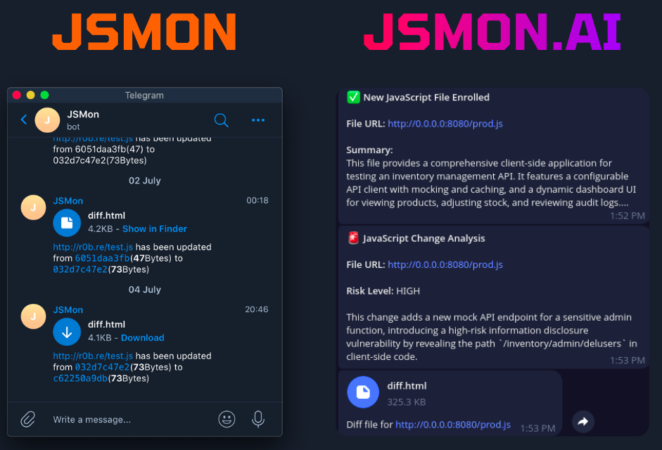

# JSMon.ai - AI-Powered JavaScript Change Monitor

JSMon.ai is an advanced script that monitors JavaScript files for changes and uses AI to provide intelligent analysis of those changes. When a monitored file is modified, you will be notified via Telegram or Slack with a risk assessment, a short summary of the change, and detailed HTML reports.

## What's New: JSMon vs JSMon.ai

JSMon.ai builds upon the original JSMon by integrating Google's Gemini AI to provide deep, contextual analysis of code changes, turning simple change alerts into actionable security and development insights.



## 🚀 Core Features

- **AI-Powered Analysis**: Uses Google's Gemini AI to analyze code changes for functional impact, security risks, and performance implications.
- **Automated Summaries**: Automatically generates a detailed, structured summary of any newly discovered JavaScript file.
- **Intelligent Notifications**: Receive alerts through Telegram or Slack that include a risk level (High/Medium/Low), a concise summary of the change, a `diff.html` file, and a styled `summary.html` report.

## 📦 Installation

1.  **Clone the repository:**
    ```bash
    git clone https://github.com/robre/jsmon.git
    cd jsmon
    ```

2.  **Run the setup script:**
    ```bash
    python setup.py
    ```
    This interactive script will check for dependencies and offer to install them from `requirements.txt`. It will also create a `.env` file for your configuration if it doesn't exist.

## ⚙️ Configuration

After running the setup script, edit the newly created `.env` file with your API keys and channel IDs.

```bash
# .env

# Telegram Notifications (required for alerts)
JSMON_NOTIFY_TELEGRAM=true
JSMON_TELEGRAM_TOKEN=YOUR_TELEGRAM_BOT_TOKEN
JSMON_TELEGRAM_CHAT_ID=YOUR_TELEGRAM_CHAT_ID

# Slack Notifications (optional)
JSMON_NOTIFY_SLACK=false
JSMON_SLACK_TOKEN=YOUR_SLACK_BOT_TOKEN
JSMON_SLACK_CHANNEL_ID=YOUR_SLACK_CHANNEL_ID

# AI Configuration (required for analysis)
GEMINI_API_KEY=YOUR_GEMINI_API_KEY
```

Model parameters are now configured in `config.json`.

## Usage

1.  **Add Targets**: Add the URLs you want to monitor into one or more text files inside the `targets/` directory.

    ```bash
    echo "https://example.com/assets/app.js" >> targets/my-app.txt
    ```

2.  **Run the Monitor**:
    ```bash
    python jsmon-ai.py
    ```

3.  **Schedule Regular Checks (Optional)**:
    Use a cron job to run the script automatically via the `jsmon-ai.sh` wrapper.

    ```bash
    crontab -e
    # Add an entry to run daily
    @daily /path/to/your/jsmon/jsmon-ai.sh
    ```

## 📁 Project Structure

```
jsmon.ai/
├── AI/                     # Core AI and logic components
│   ├── prompts/            # AI prompt templates
│   └── ...                 # Manager components
├── monitored_files/        # Stores downloaded files and analysis
│   └── {hash}/             # Directory for each unique file version
│       ├── content.js
│       ├── metadata.json
│       └── summary.json
├── targets/                # Your target URL lists go here
├── logs/                   # Application and AI interaction logs
├── .env                    # Your secret keys and configuration
├── config.json             # AI model configuration
├── jsmon-ai.py                # Main application entry point
├── setup.py                # Interactive setup script
└── requirements.txt        # Python dependencies
```

## 🙏 Acknowledgements

This project is a significant evolution of the original [JSMon](https://github.com/robre/jsmon/tree/master), created by **[@r0bre](https://twitter.com/r0bre)**.

A big shoutout to him for creating a fantastic and widely-used open-source tool for the security community. JSMon.ai builds on his foundational work by integrating modern AI capabilities.
